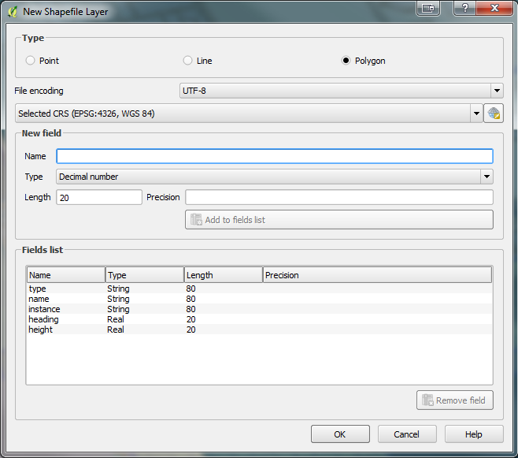
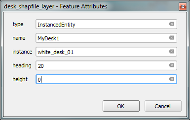
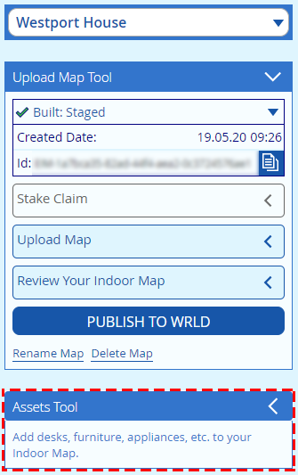
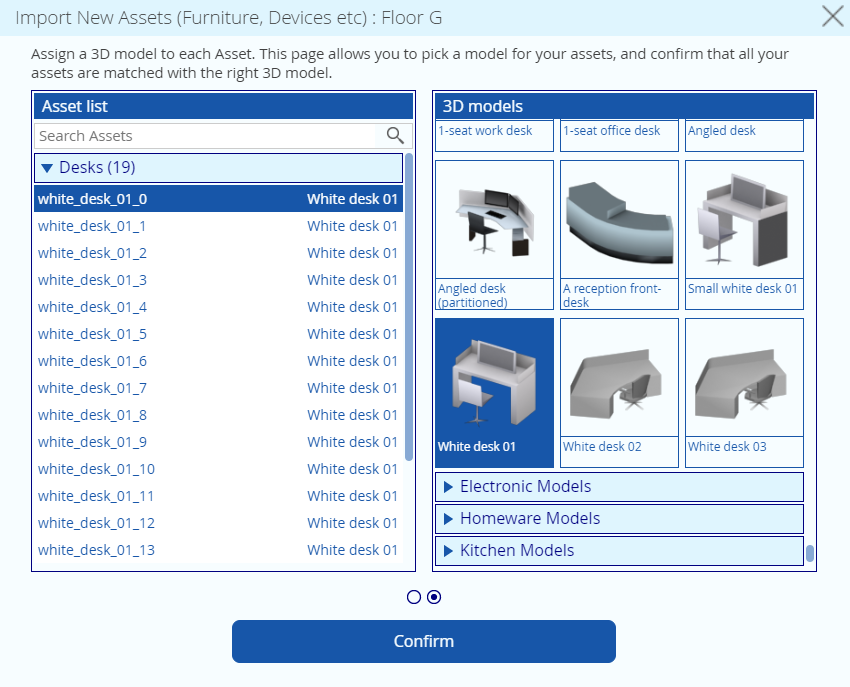
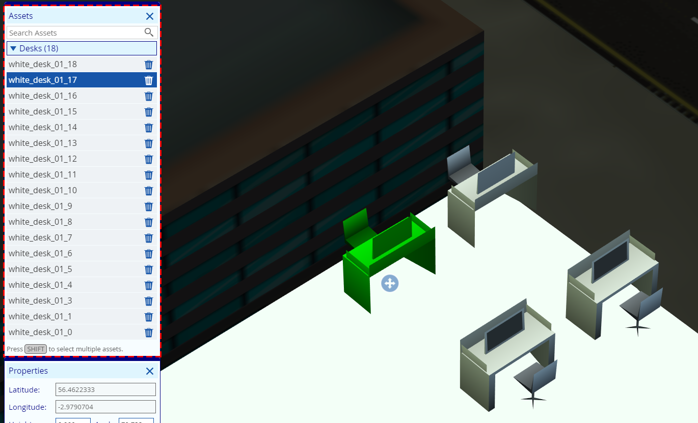
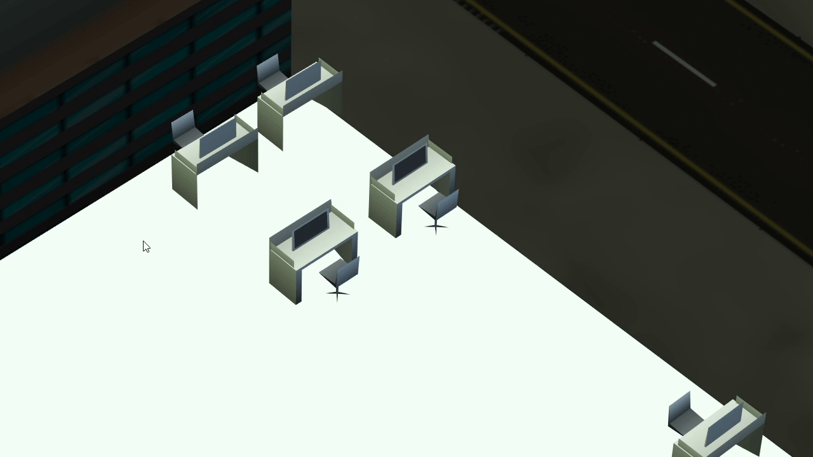
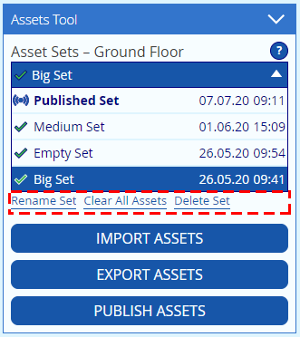

Adding Indoor Assets to your Indoor Map
=======================================

Assets are our name for any additional furnishings that can be moved around within your Indoor Map. Things like desks, chairs, sofas, tables etc. 

This tutorial will guide you through adding some Assets to a floor in a simple Indoor Map, in this case adding some desks from an example CAD file to end up with something like the following:

  

All of the files used in this example [can be found here](https://github.com/wrld3d/wrld-indoor-maps-api/tree/master/examples/cad-processing).

## Contents

- Preparation
  - [Preparing an Indoor Map](#preparing-an-indoor-map)
  - [Preparing an Asset GeoJSON Submission](#preparing-an-asset-geojson-submission)
  - [Preparing an Asset AutoCAD DXF Submission](#preparing-an-asset-autocad-dxf-submission)
    - [Creating the georeference.points file](#creating-the-georeferencepoints-file)
    - [Creating the config.json file](#creating-the-configjson-file)
      - [Rotation Calculator configuration](#rotation-calculator-configuration)
      - [Extracting names from labels](#extracting-names-from-labels)
- [Importing your Assets](#importing-your-assets)
- [Editing your Assets](#editing-your-assets)
- [Publishing your Assets](#publishing-your-assets)
- [Removing your Assets](#removing-your-assets)

## Preparing an Indoor Map

In this example we'll use a simple rectangular building as the basis for our example 'office'. Specifically, we'll use [this one here](https://maps.wrld3d.com/?lat=56.462081&lon=-2.979123&zoom=17.634631005403037&orient=293.641) near the WRLD offices.


If you haven't already followed the tutorial for submitting an indoor map, we recommend you view that first before continuing. This tutorial assumes you have successfully imported an Indoor Map with at least one floor. We include a [simple floor plan submission you can use to follow this example here](https://github.com/wrld3d/wrld-indoor-maps-api/tree/master/examples/cad-processing/floor plan).

Once you have a successfully built Indoor Map, you can continue on to importing Indoor Assets. For this you have two choices:

* Trace another layer in QGIS and output GeoJSON detailing all your Assets.
* Extract the Assets directly from an AutoCAD DXF file.

## Preparing an Asset GeoJSON Submission

Importing a GeoJSON containing all the Assets in our Indoor Map is relatively simple. If you've already [tried your hand at tracing indoor map details](TUTORIAL-TOOL.md#create-an-indoor-map-level), you can use similar methods to define a set of indoor furniture. 

First we create a new layer in QGIS 
- Create a new QGIS layer via Layer > Create Layer > New Shapefile Layer.
- When prompted, choose the Type: Polygon radio button option, then choose the appropriate CRS (again, this is typically EPSG:3857 unless your QGIS project is using something else).
- Add the following fields:



- Click “OK”.
- Give your new layer a suitable name. 
- Ensure that your new feature layer is selected in the Layers panel.
- In the layers panel, left click & drag the new feature layer to the top of the panel (we need our new layer to be the top-most layer, or it will be hidden by the others).
- As with the Indoor Map Tracing Tutorial, we'll be using a [georeferenced image of our floor plan](TUTORIAL-TOOL.md#georeference-the-floor-plan-image) to trace the desk positions.  The floor plan we're using is not an exact match, but for the purposes of this example it'll demonstrate how to trace furniture positions from a floor plan into your Indoor Map.


 - As with the Indoor Map Trace, draw a rectangle around your desks using the "Add Feature" button and populate the fields:

 

- `id` needs to be unique. We can autogenerate these later using the same technique used during the Indoor Map Trace.
- `type` must be given a value of "InstancedEntity" in order to be recognized by the Indoor Map Designer.
- `name` is up to you!
- `instance` must match a WRLD Prop ID matching one of the `prop_id`s found in [the prop manifest](https://cdn-resources.wrld3d.com/props/latest/Assets/manifest.json). This defines what 3D model will be used to show the Asset.
- `heading` defines the orientation of the WRLD Prop. Don't worry too much about getting this exact, as it can be updated after importing.
- `height` is the offset from the ground of the Asset. For anything sitting on the floor, leave this at 0.

 

Once you're ready, export your layer as a GeoJSON file the same way you did during the Indoor Map Trace:

- Highlight the layer you created in the Layers panel
- Open the Vector > Geometry Tools > Multipart to Singlepart... tool.
- Click "Run".
- Right-click on the newly-created "Single parts" layer in the Layers panel and choose Export > Save Features As...
- Under format, choose GeoJSON
- Click on the File Name browser (...) to select the location and name for your file.
- Change the CRS setting to WGS84 (EPSG: 4326)
- Check the "Add saved file to map".
- Click “OK”

> :information_source: If you want to make further edits to your assets you can just edit the GeoJSON layer rather than editing the Shapefile layer you first created and going through the conversion and export steps each time. It's now safe to remove the "Single parts" and your original Shapefile layer.

You now have an Assets GeoJSON ready to import!

> :information_source: After performing a successful AutoCAD DXF Submission below, you'll be emailed the results as a .geojson file too which you can use to reimport the result much faster in future.


## Preparing an Asset AutoCAD DXF Submission

Importing Assets from an AutoCAD DXF file is a little more involved that the GeoJSON submission method.

For this example, we'll be using a simple 'office' CAD file that looks like the image below. We'll specifically be mapping the rectangular section highlighted below to our new Indoor Map's floor - it's not an exact match, but for the purposes of this example it'll demonstrate how to read the desk positions correctly.


To do this, we need the following:
* An AutoCAD DXF file with named blocks identifying the Assets we wish to extract (e.g. desks).
* A georeference.points file to georeference the coordinates of the CAD file to the world.
* A config.json file to tell our tools how to 'read' the CAD file and interpret the desk positions.

### Creating the georeference.points file

To correctly georeference the CAD file, we specify a series of points between the CAD's coordinate system and the world's coordinate system (specifically, WGS84). The file should look something like this:

```csv
mapX,mapY,pixelX,pixelY,enable
12397.7774,11723.7745,-2.9787554,56.4618564,1
12397.7774,27443.9360,-2.9789933,56.4618060,1
63084.8731,11723.7745,-2.9790204,56.4622558,1
63084.8731,27443.9360,-2.9792483,56.4622088,1
```

This describes four points - the first two coordinates of each line specify X and Y coordinates in the DXF file, while the next two coordinates are a longitude and latitude.  Looking at our example DXF file and floor plan GeoJSON, the 4 points refer to the following:


> :information_source: You can add additional points as necessary - generally the more points you map, the more accurate the extraction process will be. For a small, rectangular floor plan like this, 4 are enough!

### Creating the config.json file

In our example, we'll be extracting the highlighted desks and representing them with a similar 3D model:


The config.json file part of our submission details how the CAD will be read by the extraction process - essentially telling it which parts are desks, chairs etc. along with how to determine their orientation and what 3D model to use to represent the Asset in your map. Our example config file looks like this:

```javascript
{
	"inserts": 
	[
		{
			"in_dxf_layer_regex": "Furniture",
			"in_dxf_instances_regex": "grdfr",
			"out_wrld_type": "placeholder",
			"out_wrld_instance": "white_desk_01",
			"opt_min_area": 10.0,
			"rotation_calculator":{
				"method":"instance_aligned",
				"alignment_layer_regex":"Furniture",
				"alignment_instances_regex":"fdss",
				"additional_rotation":-90
			}
		},
		{
			// ...Other inserts defined here...
		}
	]
}
```

We can break up each type of extracted asset into a section we call an 'insert'.  Each insert is defined by the following terms:

Parameter | Required | Description
----------|----------|------------
`in_dxf_layer_regex`|yes|Regex pattern specifying which layer/s of the CAD to search to find matching blocks representing our assets.
`in_dxf_instances_regex`|yes|Regex pattern specifying which named blocks we want to extract to represent our assets.
`in_dxf_layer_filters`|no|Additional filtering by layer if the named block found contains additional elements drawn on different layers.
`out_wrld_instance`|yes|A WRLD Prop ID matching one of the `prop_id`s found in [the prop manifest](https://cdn-resources.wrld3d.com/props/latest/Assets/manifest.json). This defines what 3D model will be used to show the Asset.
`rotation_calculator`|yes|A configuration defining how the extraction process will determine the Asset's orientation - see below for details.
`opt_min_area`|no|A minimum area any named block in the DXF must have in order to be included.
`opt_nudge_local_x`|no|Adjust the position of the 3D model after placement. 
`opt_nudge_local_y`|no|Adjust the position of the 3D model after placement. 
`opt_dxf_label_layer`|no|Used for assigning names to your Assets via additional text labels in the CAD file (See below).
`opt_dxf_label_regex`|no|Used for assigning names to your Assets via additional text labels in the CAD file (See below).
`opt_unique_instances`|no|Ignores duplicate, overlapping blocks in the DXF.

In the example config above, we have specified the following rules:

1. Look for any blocks on the layer `Furniture` with the name `grdfr`.
2. Assign a small white desk to these locations.

#### Rotation Calculator configuration

The `rotation_calculator` config block determines how the extraction process will determine the orientation of the Asset.  There are currently two modes of operation you can specify via `method`:

Method|Description
------|-----------
`default`|Use the block's rotation directly specified in the DXF file.
`instance_aligned`|Use nearby blocks to determine the orientation i.e. nearby desk chairs to determine which way a desk is orientated.

##### - Default

The simplest method - use this if you have correctly assigned all the rotations in your CAD file. It supports the following additional parameters:

Parameter | Required | Description
----------|----------|------------
`additional_rotation`|no|Apply additional rotation to the result.
`negative_scale_rotation_offset`|no|If the block is flipped in the CAD (i.e. scale is negative in one axis) it will apply this additional rotation to the model. Default is 180 degrees.


##### - Instance Aligned

This method works by using additional nearby blocks to determine anchor points we can use to determine which way the desk is facing. For example, if we know there are chair blocks nearby, we can use these to determine which way a desk is facing like so:


This is used in the example above - The extraction process will look for blocks on the layer `Furniture` that have the name `fdss` (the desk chairs). The desks will be orientated facing away from the *closest desk chair*. To get the final alignment, we need to rotate our model a further 90 degrees anticlockwise.

Parameter | Required | Description
----------|----------|------------
`alignment_layer_regex`|yes|Regex pattern specifying which layer/s of the CAD to search to find matching blocks to use for alignment.
`alignment_instances_regex`|yes|Regex pattern specifying which named blocks we want to use on the above layers to use for alignment.
`alignment_instance_layer_filters`|no|Additional filtering - specify additional layers to filter by if the named block found contains elements drawn on different layers.
`min_area`|no|As above - allows filtering based on size.
`additional_rotation`|no|Apply additional rotation to the result.


#### Extracting names from labels

By default, the extraction process assigns a placeholder name to each extracted Asset, usually based on the model chosen e.g. `white_desk_01_25`.  Sometimes you may wish to assign more meaningful names or ids to link them to external data.  To do this, the extraction process allows you to assign a name based on a nearby text label within the CAD.  Reading these labels is similar to extracting other information from the CAD:

```json
	"opt_dxf_label_layer": "labelLayer",
	"opt_dxf_label_regex": "(\\d{4}-\\d{3}-\\d{4})",
```

In this above example, we specify a layer of the CAD named `labelLayer` to read the text labels from. We perform a regex to extract a specific pattern from the text - in this case, a pattern of 4 digits, a dash, 3 digits, a dash, and finally 4 digits - which would extract something like "1234-567-1234" from a label and assign it as the name to the nearest desk.  Note that if text labels are not positioned correctly over every desk, you risk assigning the wrong names or the same name to multiple desks.

Assets can also be renamed individually after importing.


## Importing your Assets

With your files prepared, you can now begin the extraction process!

- If you're importing GeoJSON directly, you're all set!
- If you're importing the combined cad.dxf, config.json and georeference.points files, begin by zipping the 3 files together in a .zip file (similar to cad_submission.zip in our examples directory). 
- Navigate to the [WRLD Indoor Map Designer](https://mapdesigner.wrld3d.com/indoormap/latest/) (login if necessary).
- Select your Indoor Map from the drop down list and go inside by clicking the Entrance Marker on the map.
- Select the floor you wish to add Assets to using the elevator widget on the right of the screen.
- Open up the "Assets Tool" panel you see here:



- Click the  button to begin the process.
- Drag and drop your .zip or .geojson file onto the displayed panel, or click to open the File Explorer and select it manually.
- Wait for the process to complete!

If successful, you should see the following screen - this lets you preview how many Assets the extraction process was able to find, and what model it intends to use for each one.



Hit continue and after a bit more processing you should now see your Assets inside your Indoor Map!


## Editing your Assets

Now that you've imported your Assets, you can make any changes you wish to their position or orientation. To do this, you can either click on the model directly, or select it from the Asset List panel. Selected Assets are highlighted onscreen. In the Asset List panel you can also delete individual assets if required.



Selecting an Asset also shows the Asset Properties panel, which allows you to edit the selected Asset in more detail.


> :information_source: Some options are only applicable when a single Asset is selected.

You can also move selected Assets by clicking and dragging the gizmo.



## Publishing your Assets

Each time you do a new import to a floor, you create a new "Asset Set" with your imported contents. You can have multiple Asset Sets per floor, but only one can be treated as "live" - the version other users will see in your Indoor Map. When you've finished preparing your Asset Set and want to make it live, you publish it.

You do this via the  button.

> :warning: Once you publish your set, they become visible to anyone viewing your Indoor Map. Make sure everything's correct first!

The act of publishing a set creates a new set in your Asset Set list selector called "Published Set". This is a special set you can view that shows what the current "live" Assets for a given floor look like. Every time you publish a new set, it replaces any existing published set.

At this point, when viewing your Indoor Map in the WRLD APIs you should now see your desks appear.

> :information_source: The published set cannot be edited like normal sets - You cannot move Indoor Assets around or delete them - To make changes to the published set, select the original set from the list, make the changes there, and republish the set. This replaces the existing published set with an updated one.

## Removing your Assets

If you need to remove your Assets entirely from your Indoor Map, you can do this using the commands located at the bottom of the Add Assets panel.



You can also rename your Asset Set to a more meaningful name, which will help if you plan on keeping multiple versions.

> :warning: Unpublishing the published set will cause Indoor Assets to stop appearing in your Indoor Map for anyone viewing your map.


